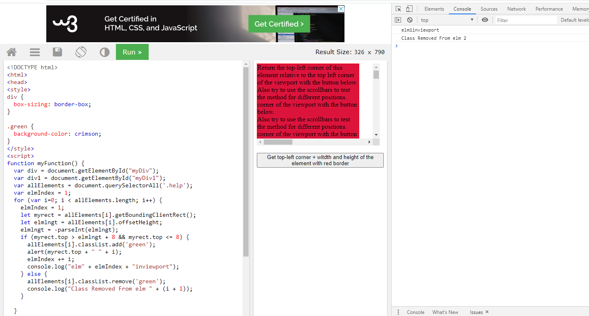
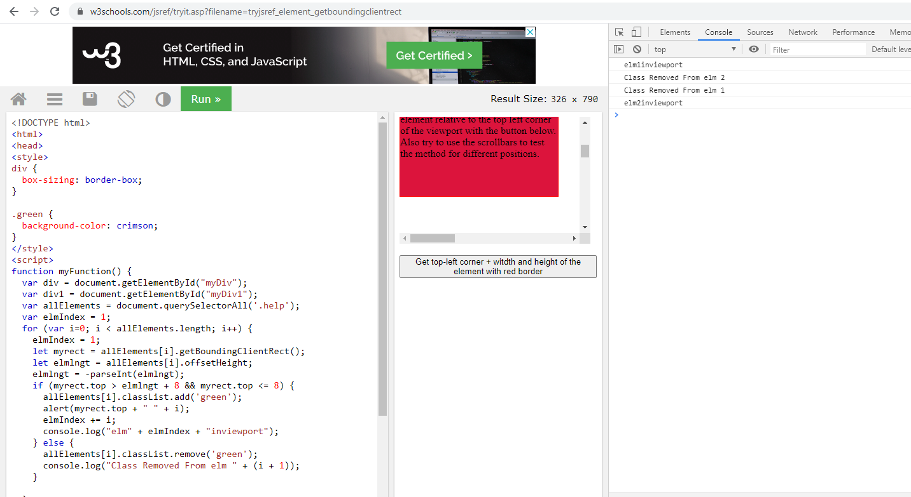

# react1

# !notes 

*  set   box-sizing: border-box;
*  element height + 8 becuase there is margin in body you can remove it use  0 ```css body {margin:0;} ```




## main idea
```javaScript
document.getElementById("cont").addEventListener('scroll', myFunction);
function myFunction() {
  var div = document.getElementById("myDiv");
  var div1 = document.getElementById("myDiv1");
  var allElements = document.querySelectorAll('.help');
  var elmIndex = 1;
  for (var i=0; i < allElements.length; i++) {
    elmIndex = 1;
    let myrect = allElements[i].getBoundingClientRect();
    let elmlngt = allElements[i].offsetHeight; // clientHeight

    elmlngt = -parseInt(elmlngt);
    if (myrect.top > elmlngt + 8 && myrect.top <= 8) {
      allElements[i].classList.add('green');
      elmIndex += i;
      console.log("elm" + elmIndex + "inviewport");
    } else {
      allElements[i].classList.remove('green');
      console.log("Class Removed From elm " + (i + 1));
    }
    
  }
  
  
}

```
